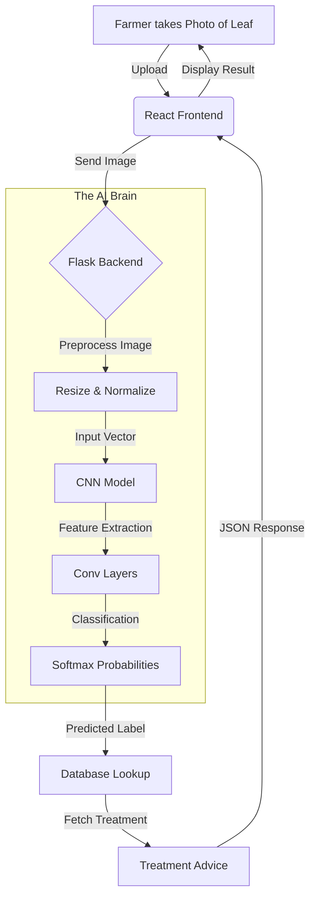

# 🔄 System Flow: Disease Prediction

## 1. High-Level Overview
The system follows a simple "Input-Process-Output" flow:
`Farmer (Image)` → `Website` → `Server (CNN Model)` → `Diagnosis & Cure`

---

## 2. Detailed Data Flow Diagram

---

## 3. Step-by-Step Walkthrough

### Step 1: User Action
*   **Farmer:** Notices a spot on a tomato leaf.
*   **Action:** Opens the app, clicks "Upload Image," and selects the photo.

### Step 2: Frontend to Backend
*   **React:** Converts the image to a format suitable for transfer.
*   **API Call:** Sends a `POST` request to `/detect-disease` with the image file.

### Step 3: Server Processing
*   **Flask:** Receives the image.
*   **Preprocessing:**
    1.  Opens image.
    2.  Resizes to **224x224**.
    3.  Converts to Numpy Array.
    4.  Normalizes (Pixel values / 255.0).

### Step 4: AI Inference
*   The pre-processed array is fed into the loaded **CNN Model**.
*   The model calculates probability scores for all 38 classes.
*   **Result:** It picks the highest score (e.g., "Tomato___Early_blight" with 98% confidence).

### Step 5: Post-Processing
*   The system takes the label "Tomato___Early_blight".
*   It looks up the **Treatment Dictionary**:
    *   *Organic:* "Use Neem Oil."
    *   *Chemical:* "Use Copper Fungicide."

### Step 6: Response
*   The server sends back: `{ "disease": "Early Blight", "confidence": 98, "treatment": "..." }`.
*   **Frontend:** Displays the disease name in Red (if dangerous) and shows the cure steps.

---

## 4. Practical Farmer Use-Case

**Scenario:**
Lakshmi is a potato farmer. She sees black spots on her leaves. She is worried it might be the deadly "Late Blight" which destroyed her crop last year.

**Using Crop Guru:**
1.  She uploads a photo.
2.  **System Result:** "Potato Early Blight" (Confidence: 92%).
3.  **Advice:** "Don't panic. This is Early Blight, not Late Blight. It is less severe. Remove infected leaves and spray organic compost tea."

**Outcome:**
*   Lakshmi is relieved.
*   She avoids using strong, expensive chemicals (which she would have used for Late Blight).
*   **Result:** Money saved, environment protected, crop saved.
