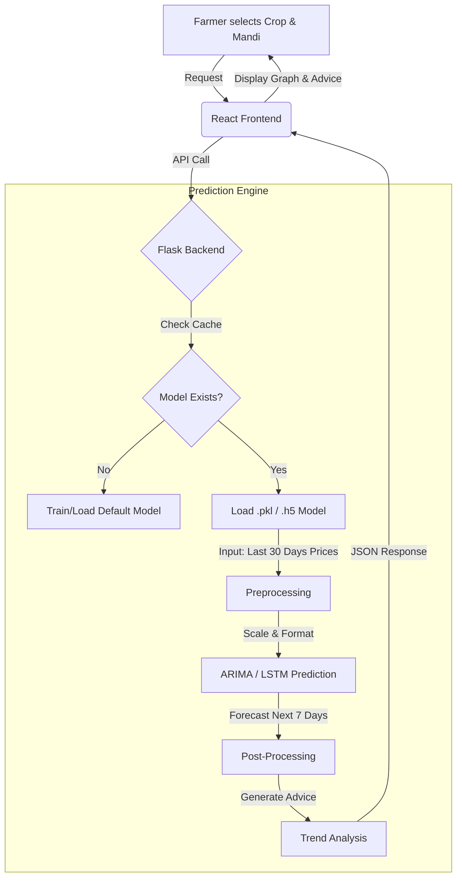

# 🔄 Price Prediction System Flow

## 1. High-Level Architecture
**The Flow:**
`Farmer (User)` ↔ `Frontend (React)` ↔ `Backend (Flask)` ↔ `ML Engine (ARIMA/LSTM)`

---

## 2. Detailed Data Flow Diagram

---

## 3. Step-by-Step Walkthrough

### Step 1: User Request
- **User:** Selects "Tomato" and "Mumbai".
- **Action:** Clicks "Predict Price".
- **Frontend:** Sends `POST /predict-price` with `{crop: 'Tomato', mandi: 'Mumbai'}`.

### Step 2: Backend Processing
- **Server:** Checks if a specific trained model exists for Tomato-Mumbai.
- **Data:** Loads the historical price data (saved context).

### Step 3: Model Inference
- **Input:** The model takes the last known prices (e.g., last 30 days).
- **Process:**
    - If **LSTM:** Scales data (0-1), feeds into Neural Network, predicts next step, loops 7 times.
    - If **ARIMA:** Uses the mathematical formula to forecast next 7 steps.
- **Output:** A list of 7 future prices.

### Step 4: Logic & Advice
- **Comparison:**
    - Today's Price: ₹2,000
    - Forecast Day 7: ₹2,200
- **Logic:** `(2200 - 2000) / 2000 = +10%`
- **Decision:** Price is rising significantly.
- **Advice Generated:** "High chance of profit. Recommended to HOLD for 1 week."

### Step 5: Visualization
- The frontend receives the data and draws a **Line Chart**:
    - **Blue Line:** Past Prices.
    - **Red Dashed Line:** Future Forecast.
- The advice is shown in a highlighted box.

---

## 4. Practical Farmer Use-Case

**Scenario:**
Ramesh is a tomato farmer. He has harvested 500kg of tomatoes.
- Current Market Price: ₹20/kg.
- Total Value: ₹10,000.

**Using Crop Guru:**
1.  He checks the app.
2.  The app predicts price will rise to ₹25/kg in 5 days due to expected supply shortage.
3.  **Advice:** "Wait for 5 days."

**Outcome:**
- Ramesh waits.
- Sells at ₹25/kg.
- Total Value: ₹12,500.
- **Net Gain:** ₹2,500 extra profit just by using the app.
